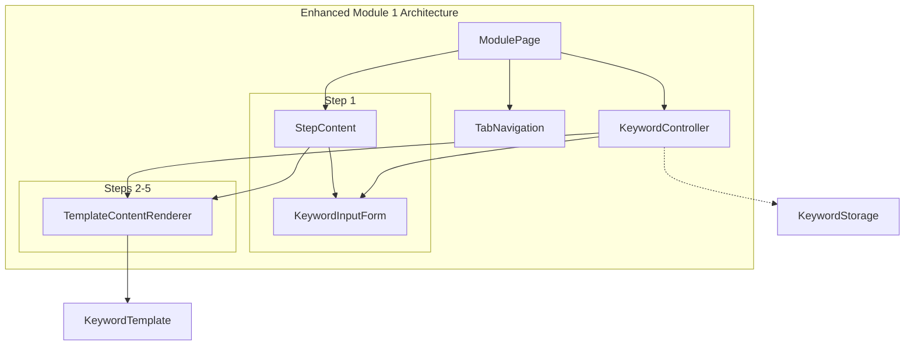
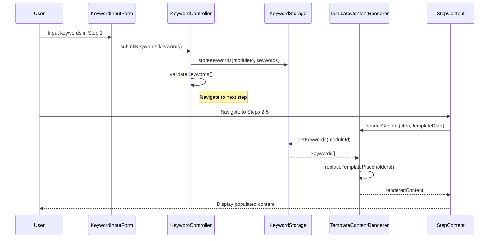
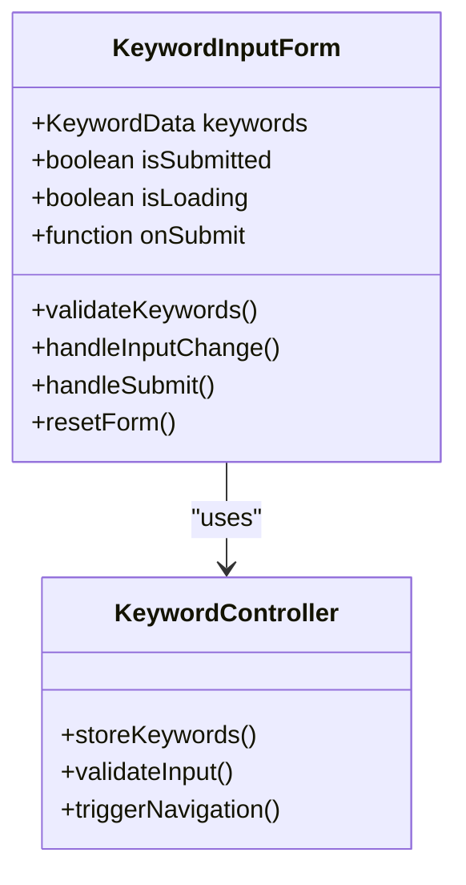
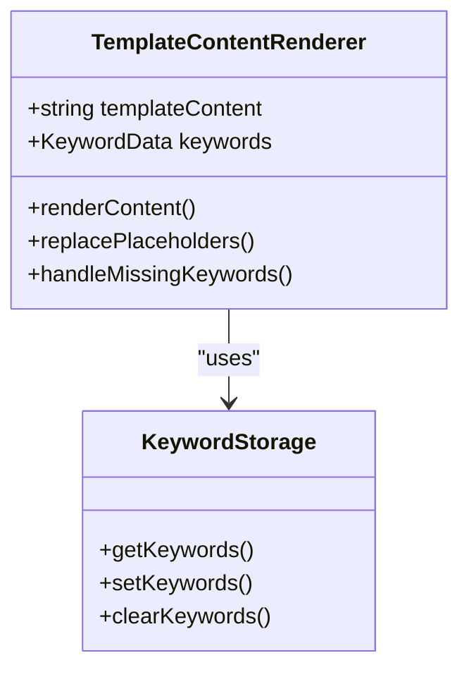
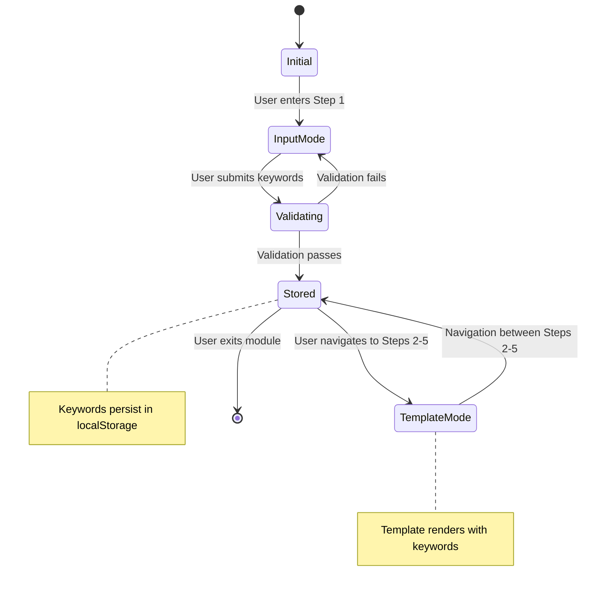
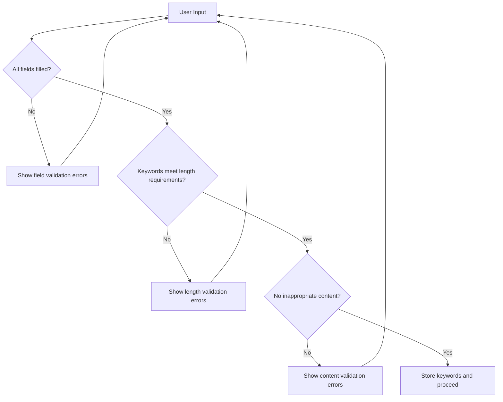

# Keyword Auto-Fill Feature Design

## Overview

This feature enhances Module 1 of the territory education application by introducing a dynamic keyword auto-fill system. Users will input 4 keywords in Step 1 through individual input boxes, which will automatically populate template placeholders in the remaining steps (2-5).

The template message structure follows this pattern:
```
영토 분쟁을 사례로 캠페인 노래를 만들거야. 이 사례는 [keyword1]이/가 갈등을 겪고 있고,
[keyword2]이/가 핵심적인 분쟁 배경이야. 해결 방안으로는 [keyword3]이/가 필요해. [keyword4]
```

## Architecture

### Component Architecture Enhancement

The feature extends the existing component structure without breaking changes:



### Data Flow Architecture



## Data Models & Type Extensions

### New TypeScript Interfaces

```typescript
// Keyword-related interfaces
export interface KeywordData {
  keyword1: string;  // 갈등 주체
  keyword2: string;  // 분쟁 배경
  keyword3: string;  // 해결 방안
  keyword4: string;  // 추가 내용
}

export interface KeywordTemplate {
  template: string;
  placeholders: string[];
}

export interface ModuleKeywordConfig {
  moduleId: string;
  hasKeywordFeature: boolean;
  keywordInputStepId: string;
  templateSteps: string[];
  template: KeywordTemplate;
}

// Extended existing interfaces
export interface ModuleStep {
  id: string;
  title: string;
  description: string;
  content: string;
  externalLink?: ExternalLink;
  editableContent?: boolean;
  // New properties
  isKeywordInput?: boolean;
  useKeywordTemplate?: boolean;
  templateContent?: string;
}
```

### Enhanced Module Configuration

The modules.ts structure for Module 1 will be enhanced:

```typescript
export const MODULE_1_KEYWORD_CONFIG: ModuleKeywordConfig = {
  moduleId: "1",
  hasKeywordFeature: true,
  keywordInputStepId: "step-1",
  templateSteps: ["step-2", "step-3", "step-4", "step-5"],
  template: {
    template: "영토 분쟁을 사례로 캠페인 노래를 만들거야. 이 사례는 [keyword1]이/가 갈등을 겪고 있고, [keyword2]이/가 핵심적인 분쟁 배경이야. 해결 방안으로는 [keyword3]이/가 필요해. [keyword4]",
    placeholders: ["[keyword1]", "[keyword2]", "[keyword3]", "[keyword4]"]
  }
};
```

## Component Specifications

### KeywordInputForm Component

**Location**: `src/components/KeywordInputForm.tsx`

**Purpose**: Renders 4 input fields for keyword collection in Module 1, Step 1



**Key Features**:
- Individual labeled input boxes for each keyword
- Real-time validation
- Submit button with loading state
- Clear visual feedback
- Accessible form structure

### TemplateContentRenderer Component

**Location**: `src/components/TemplateContentRenderer.tsx`

**Purpose**: Replaces template placeholders with user-entered keywords



### KeywordController Service

**Location**: `src/services/keywordController.ts`

**Purpose**: Manages keyword state and coordination between components

**Responsibilities**:
- Keyword validation and storage
- State management across steps
- Integration with existing navigation flow
- Error handling and user feedback

## State Management Strategy

### Local Storage Integration

Keywords will be persisted using browser localStorage with the following structure:

```typescript
interface StoredKeywordData {
  moduleId: string;
  keywords: KeywordData;
  timestamp: number;
  expiresAt?: number;
}

// Storage key pattern: `territory-keywords-module-${moduleId}`
```

### State Lifecycle Management



## User Interface Design

### Step 1: Keyword Input Interface

```
┌─────────────────────────────────────────────────────┐
│ Module 1 - Step 1: Keyword Input                    │
├─────────────────────────────────────────────────────┤
│                                                     │
│ 캠페인 노래 만들기를 위한 핵심 정보를 입력하세요     │
│                                                     │
│ 갈등 주체: [________________]                       │
│                                                     │
│ 분쟁 배경: [________________]                       │
│                                                     │
│ 해결 방안: [________________]                       │
│                                                     │
│ 추가 내용: [________________]                       │
│                                                     │
│           [키워드 적용하기]                         │
│                                                     │
└─────────────────────────────────────────────────────┘
```

### Steps 2-5: Template Content Display

```
┌─────────────────────────────────────────────────────┐
│ Module 1 - Step 2: 콘텐츠 생성                      │
├─────────────────────────────────────────────────────┤
│                                                     │
│ 학습 내용:                                          │
│                                                     │
│ 영토 분쟁을 사례로 캠페인 노래를 만들거야.          │
│ 이 사례는 독도가 갈등을 겪고 있고,                  │
│ 역사적 주권이 핵심적인 분쟁 배경이야.               │
│ 해결 방안으로는 국제법 적용이 필요해.               │
│ 평화적 해결이 중요하다.                             │
│                                                     │
│ [키워드 수정하기] (Step 1로 돌아가기)                │
│                                                     │
└─────────────────────────────────────────────────────┘
```

## Integration with Existing Components

### ModulePage Component Enhancement

**Minimal Changes Required**:
- Add keyword state management
- Integrate KeywordController
- Pass keyword data to StepContent

### StepContent Component Enhancement

**Conditional Rendering Logic**:
```typescript
// Enhanced StepContent rendering
if (step.isKeywordInput && moduleId === "1") {
  return <KeywordInputForm onSubmit={handleKeywordSubmit} />;
} else if (step.useKeywordTemplate && keywords) {
  return <TemplateContentRenderer 
    step={step} 
    keywords={keywords} 
    onExternalLinkClick={onExternalLinkClick} 
  />;
} else {
  // Existing content rendering
  return <StandardStepContent step={step} onExternalLinkClick={onExternalLinkClick} />;
}
```

## Data Storage Strategy

### Browser Storage Implementation

```typescript
class KeywordStorageService {
  private static STORAGE_KEY_PREFIX = 'territory-keywords-module-';
  
  static storeKeywords(moduleId: string, keywords: KeywordData): void {
    const data: StoredKeywordData = {
      moduleId,
      keywords,
      timestamp: Date.now(),
      expiresAt: Date.now() + (24 * 60 * 60 * 1000) // 24 hours
    };
    localStorage.setItem(
      `${this.STORAGE_KEY_PREFIX}${moduleId}`, 
      JSON.stringify(data)
    );
  }
  
  static getKeywords(moduleId: string): KeywordData | null {
    const stored = localStorage.getItem(`${this.STORAGE_KEY_PREFIX}${moduleId}`);
    if (!stored) return null;
    
    const data: StoredKeywordData = JSON.parse(stored);
    if (data.expiresAt && Date.now() > data.expiresAt) {
      this.clearKeywords(moduleId);
      return null;
    }
    
    return data.keywords;
  }
}
```

## Error Handling & Validation

### Input Validation Rules



### Validation Specifications

- **Required Fields**: All 4 keyword fields must be filled
- **Length Limits**: 1-50 characters per keyword
- **Content Filtering**: Basic inappropriate content detection
- **Character Restrictions**: Korean and English text only

### Error State Management

```typescript
interface ValidationState {
  keyword1Error?: string;
  keyword2Error?: string;
  keyword3Error?: string;
  keyword4Error?: string;
  generalError?: string;
  isValid: boolean;
}
```

## Testing Strategy

### Unit Testing Requirements

**KeywordInputForm Tests**:
- Input validation functionality
- Form submission handling
- Error state management
- Accessibility compliance

**TemplateContentRenderer Tests**:
- Placeholder replacement accuracy
- Missing keyword handling
- Content sanitization
- Performance with large templates

**KeywordController Tests**:
- Storage operations
- State synchronization
- Cross-step navigation
- Error recovery

### Integration Testing Scenarios

1. **Complete User Flow**: Input keywords → Navigate through steps → Verify template population
2. **Data Persistence**: Refresh page → Verify keywords persist → Complete module
3. **Error Recovery**: Invalid input → Correction → Successful submission
4. **Cross-Module Navigation**: Module 1 → Other modules → Return to Module 1

## Performance Considerations

### Optimization Strategies

**Template Rendering**:
- Cache processed templates
- Lazy load template content
- Debounce real-time preview updates

**Storage Operations**:
- Minimize localStorage writes
- Implement storage quota management
- Use efficient serialization

**Component Re-rendering**:
- Memoize expensive computations
- Optimize React re-render cycles
- Implement virtual scrolling for long content

## Accessibility Features

### WCAG Compliance Requirements

**Form Accessibility**:
- Proper label associations
- ARIA attributes for validation states
- Keyboard navigation support
- Screen reader compatibility

**Content Navigation**:
- Logical tab order
- Clear focus indicators
- Alternative text for dynamic content
- High contrast mode support

## Migration Strategy

### Implementation Phases

**Phase 1**: Core Infrastructure
- Implement base TypeScript interfaces
- Create KeywordController service
- Set up storage system

**Phase 2**: UI Components
- Develop KeywordInputForm
- Create TemplateContentRenderer
- Integrate with existing StepContent

**Phase 3**: Integration & Testing
- Connect components to ModulePage
- Implement error handling
- Conduct thorough testing

**Phase 4**: Deployment & Monitoring
- Deploy to production
- Monitor user interactions
- Gather feedback for improvements

### Backward Compatibility

- Existing modules (2-6) remain unchanged
- Module 1 fallback to standard content if keyword feature fails
- Graceful degradation for unsupported browsers

## Security Considerations

### Input Sanitization

```typescript
class ContentSanitizer {
  static sanitizeKeyword(input: string): string {
    return input
      .trim()
      .replace(/<[^>]*>/g, '') // Remove HTML tags
      .replace(/[<>&"']/g, match => { // Escape special characters
        const escapeMap: {[key: string]: string} = {
          '<': '&lt;',
          '>': '&gt;',
          '&': '&amp;',
          '"': '&quot;',
          "'": '&#x27;'
        };
        return escapeMap[match];
      });
  }
}
```

### Data Protection

- No sensitive information in keywords
- Local storage encryption for sensitive environments
- XSS prevention through proper escaping
- CSRF protection for any server communications