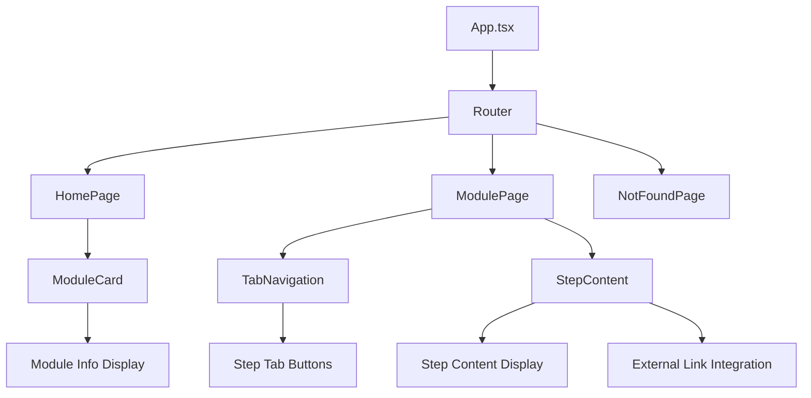
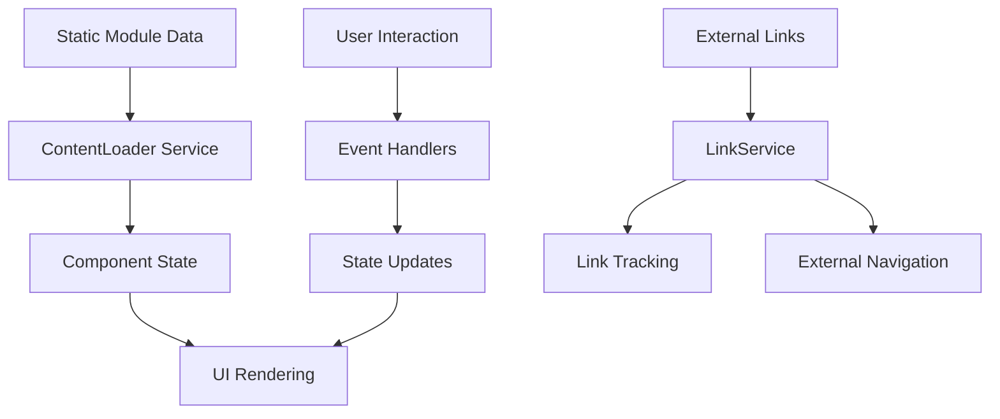

# Territory Education Modules Web Application Design

## Overview

The Territory Education Modules Web Application is a React-based educational platform designed to provide structured learning modules about Korean territorial education. The application features 6 distinct educational modules, each containing exactly 5 step-by-step learning tabs with external link integration for comprehensive learning experiences.

### Project Goals
- Provide systematic territory education through interactive web modules
- Enable 5-step learning progression per module with tab-based navigation
- Offer customizable content sections for educators
- Deliver responsive, accessible learning experience with consistent module structure

### Target Users
- Students learning about Korean territorial concepts
- Educators delivering territory education content
- Educational administrators managing territorial learning programs

## Technology Stack & Dependencies

### Core Framework
- **React 18.2.0**: Component-based UI framework
- **TypeScript 5.0.2**: Type safety and enhanced development experience
- **React Router DOM 6.15.0**: Client-side routing and navigation

### Build & Development Tools
- **Vite 4.4.5**: Fast build tool and development server
- **TypeScript ESLint**: Code quality and consistency
- **PostCSS**: CSS processing pipeline

### Styling Framework
- **Tailwind CSS 3.3.3**: Utility-first CSS framework
- **Autoprefixer**: CSS vendor prefixing
- **Custom Design System**: Territory-themed color palette

### Project Structure
```
src/
├── components/          # React components
│   ├── HomePage.tsx     # Main landing page
│   ├── ModuleCard.tsx   # Module selection cards
│   ├── ModulePage.tsx   # Individual module pages
│   ├── StepContent.tsx  # Step content display
│   └── TabNavigation.tsx # Tab navigation system
├── data/               # Static data and configuration
│   └── modules.ts      # Module definitions and content
├── services/           # Business logic and utilities
│   └── linkService.ts  # External link management
├── types/              # TypeScript type definitions
│   └── index.ts        # Application interfaces
├── App.tsx             # Main application component
├── index.css           # Global styles and component classes
└── main.tsx           # Application entry point
```

## Component Architecture

### Component Hierarchy



### Component Definitions

#### HomePage Component
**Purpose**: Main landing page displaying all available learning modules
**State Management**:
- `modules`: Array of ModuleInfo objects
- `loading`: Boolean loading state
- `error`: Error message string

**Props**: None (root component)

**Key Features**:
- Module grid layout (responsive: 1 col mobile, 2 col tablet, 3 col desktop)
- Loading spinner during data fetch
- Error handling with user feedback
- Navigation to individual modules

#### ModuleCard Component
**Purpose**: Individual module selection card with preview information
**Props**:
- `module: ModuleInfo` - Module metadata
- `onClick: () => void` - Selection handler

**Features**:
- Gradient background with module identifier
- Module title and description display
- Step count indicator
- Hover effects and keyboard navigation
- Accessibility support (ARIA roles, keyboard events)

#### ModulePage Component
**Purpose**: Individual module learning interface with 5-step tab navigation
**State Management**:
- `moduleData`: Complete module data including exactly 5 steps
- `activeStepId`: Currently selected step identifier (step-1 through step-5)
- `loading/error`: Standard async state handling

**Key Features**:
- Dynamic module data loading based on URL parameter
- 5-tab navigation system for consistent learning progression
- Progress indicator showing completion (1/5, 2/5, etc.) in fixed bottom-right position
- Back to home navigation with breadcrumb functionality
- URL hash integration for step bookmarking (supports deep linking to specific steps)
- Step completion tracking for user progress monitoring

#### TabNavigation Component
**Purpose**: Horizontal tab interface for 5-step navigation per module
**Props**:
- `steps: ModuleStep[]` - Array of exactly 5 module steps
- `activeStep: string` - Currently active step ID
- `onStepChange: (stepId: string) => void` - Step selection handler

**Features**:
- Fixed 5-tab layout with responsive design
- Visual step indicators (numbered badges 1-5)
- Keyboard navigation (arrow keys for sequential step access)
- Active state styling with clear progression indicators
- Mobile-optimized display (step numbers visible, titles hidden on small screens)
- Tab completion tracking for learning progress

#### StepContent Component
**Purpose**: Display individual step content with external link integration
**Props**:
- `step: ModuleStep` - Step data and configuration
- `onExternalLinkClick: (url: string) => void` - External link handler

**Content Sections**:
- Step header (title and description)
- Learning content (formatted text in styled container)
- External link section (when available)
- Editable content indicator (when applicable)

## Routing & Navigation

### Route Configuration
```typescript
Routes:
  "/" → HomePage (Module selection grid)
  "/module/:moduleId" → ModulePage (Individual module interface)
  "*" → NotFoundPage (404 error handling)
```

### Navigation Patterns
- **Homepage to Module**: Click-based navigation via ModuleCard
- **Module Navigation**: Tab-based step progression
- **External Links**: New tab opening with tracking
- **Back Navigation**: Breadcrumb-style back to home button
- **URL Integration**: Hash-based step bookmarking

## Styling Strategy

### Design System Configuration
```javascript
// Tailwind Custom Theme
colors: {
  territory: {
    primary: "#1e40af",   // Deep blue
    secondary: "#3b82f6", // Medium blue  
    accent: "#60a5fa"     // Light blue
  }
}
```

### Component Styling Classes
- `.module-card`: Styled module selection cards
- `.tab-button`: Base tab styling with states
- `.tab-button-active/inactive`: Tab state variations
- `.external-link-button`: Styled external link buttons

### Responsive Design
- Mobile-first approach using Tailwind breakpoints
- Grid layouts: `grid-cols-1 md:grid-cols-2 lg:grid-cols-3` for module cards
- 5-tab navigation: Numbered indicators (1-5) visible on all screen sizes, step titles hidden on mobile
- Flexible padding and spacing across screen sizes
- Horizontal scroll support for tab navigation on very small screens
- Progress indicator adapts to screen size (compact view on mobile)

## State Management

### Data Flow Architecture


### State Management Pattern
- **Local Component State**: React useState for UI state
- **Async Data Loading**: useEffect with loading/error states
- **Service Layer**: Dedicated services for data and external interactions
- **Type Safety**: Full TypeScript coverage for state shapes

### Key State Objects
```typescript
// Module metadata for homepage
interface ModuleInfo {
  id: string;
  title: string;
  description: string;
  stepCount: number;
}

// Complete module data for learning interface
interface ModuleData {
  id: string;
  title: string;
  description: string;
  steps: ModuleStep[];
}

// Individual learning step
interface ModuleStep {
  id: string;
  title: string;
  description: string;
  content: string;
  externalLink?: ExternalLinkConfig;
  editableContent?: boolean;
}
```

## API Integration Layer

### Service Architecture
The application uses a service layer pattern for data management and external integrations:

#### ContentLoader Service
**Purpose**: Static data loading and module management
**Methods**:
- `loadModuleData(moduleId: string)`: Load complete module with steps
- `loadAllModules()`: Load module metadata for homepage

**Implementation**: Static import-based loading from `modules.ts` data file

#### LinkService 
**Purpose**: External link management and tracking
**Methods**:
- `validateUrl(url: string)`: URL validation
- `trackLinkClick(moduleId, stepId, url)`: Usage analytics
- `openExternalLink(url, newTab)`: Controlled external navigation

**Features**:
- URL validation before navigation
- Click tracking for analytics integration
- Security controls (noopener, noreferrer)

### Data Configuration
```typescript
// Static module configuration in data/modules.ts
// Each module contains exactly 5 steps
export const MODULES_DATA: ModuleConfig = {
  modules: {
    "1": {
      id: "1",
      title: "여기를 수정하세요 - 영토교육 모듈 1",
      description: "여기를 수정하세요 - 첫 번째 영토교육 모듈 설명",
      steps: [
        {
          id: "step-1",
          title: "여기를 수정하세요 - 단계 1",
          content: "여기를 수정하세요 - 단계 1 상세 내용",
          externalLink: {
            url: "https://example.com/step1",
            label: "여기를 수정하세요 - 외부 링크",
            openInNewTab: true
          },
          editableContent: true
        },
        {
          id: "step-2",
          title: "여기를 수정하세요 - 단계 2",
          content: "여기를 수정하세요 - 단계 2 상세 내용",
          editableContent: true
        },
        {
          id: "step-3",
          title: "여기를 수정하세요 - 단계 3",
          content: "여기를 수정하세요 - 단계 3 상세 내용",
          editableContent: true
        },
        {
          id: "step-4",
          title: "여기를 수정하세요 - 단계 4",
          content: "여기를 수정하세요 - 단계 4 상세 내용",
          editableContent: true
        },
        {
          id: "step-5",
          title: "여기를 수정하세요 - 단계 5",
          content: "여기를 수정하세요 - 단계 5 상세 내용",
          externalLink: {
            url: "https://example.com/step5",
            label: "여기를 수정하세요 - 완료 링크",
            openInNewTab: true
          },
          editableContent: true
        }
      ]
    }
    // ... additional modules 2-6 (each with 5 steps)
  }
};
```

## Testing Strategy

### Component Testing Approach
- **Test Structure**: Individual component unit tests
- **Testing Library**: Jest + React Testing Library (configured in Vite)
- **Test Coverage**: Component rendering, user interactions, navigation

### Key Testing Scenarios
1. **HomePage Tests**:
   - Module grid rendering
   - Loading and error states
   - Module selection navigation

2. **ModulePage Tests**:
   - Dynamic module loading with 5-step validation
   - 5-tab navigation functionality (step-1 through step-5)
   - Sequential step progression testing
   - Step content display for each of the 5 steps
   - External link integration per step
   - Progress indicator accuracy (showing X/5 completion)

3. **Service Tests**:
   - Content loading validation
   - URL validation logic
   - Link tracking functionality

### Testing Data Attributes
Components include `data-testid` attributes for reliable testing:
```typescript
// Example test identifiers
data-testid="module-card-${module.id}"
role="tab" aria-selected={isActive}
role="tabpanel" id="tabpanel-${step.id}"
```

## Accessibility Features

### ARIA Implementation
- **Tab Navigation**: Full ARIA tab interface with role attributes
- **Keyboard Navigation**: Arrow key support for tab switching
- **Screen Reader Support**: Proper labeling and state announcements
- **Focus Management**: Logical tab order and visual focus indicators

### Accessibility Standards
- **WCAG 2.1 Compliance**: AA level accessibility standards
- **Keyboard Navigation**: Full keyboard operation support
- **Color Contrast**: Sufficient contrast ratios in design system
- **Semantic HTML**: Proper heading hierarchy and element usage

### Implementation Examples
```typescript
// Tab navigation accessibility
<button
  role="tab"
  aria-selected={isActive}
  aria-controls={`tabpanel-${step.id}`}
  tabIndex={isActive ? 0 : -1}
  onKeyDown={handleKeyboardNavigation}
>

// Content panel accessibility  
<div 
  role="tabpanel"
  id={`tabpanel-${step.id}`}
  aria-labelledby={`tab-${step.id}`}
>
```

## User Experience Features

### Progressive Enhancement
- **Loading States**: Smooth loading indicators during data fetch
- **Error Handling**: User-friendly error messages with recovery options
- **Responsive Design**: Optimized experience across all device sizes
- **Performance**: Fast navigation with minimal re-renders

### Interactive Elements
- **Hover Effects**: Visual feedback on interactive elements
- **Transition Animations**: Smooth state changes and navigation between 5 steps
- **Progress Tracking**: Visual progress indicator showing completion (1/5, 2/5, 3/5, 4/5, 5/5)
- **Step Navigation**: Clear visual indicators for current step position within 5-step sequence
- **External Link Safety**: Secure external navigation with user awareness
- **Sequential Learning**: Logical step progression encouraging completion of all 5 steps

### Customization Features
- **Editable Content Markers**: Clear indicators for modifiable sections
- **Flexible Module Structure**: Easy addition/modification of modules and steps
- **Configurable External Links**: Per-step external resource integration
- **Responsive Layout**: Automatic adaptation to content length and screen size