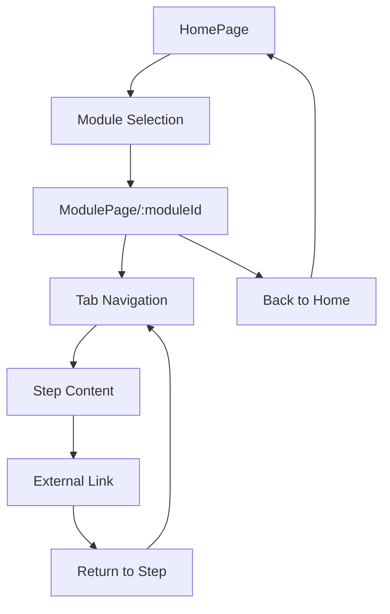

# Territory Education Modules Web Application Design

## Overview

A React-based web application for territory education featuring 6 educational modules. Each module provides step-by-step learning experiences through tabbed navigation that links to external resources for procedural execution.

### Key Features
- 6 distinct educational modules accessible from main homepage
- Individual pages for each module with tabbed step-by-step navigation
- External link integration for procedural steps
- Responsive design with Tailwind CSS
- TypeScript for type safety
- Modular architecture for easy content updates

## Technology Stack & Dependencies

### Core Framework
- **React 18+** - Component-based UI framework
- **TypeScript** - Static type checking and enhanced developer experience
- **React Router DOM** - Client-side routing for navigation

### Styling & UI
- **Tailwind CSS** - Utility-first CSS framework for responsive design
- **Headless UI** - Unstyled, accessible UI components (optional for tabs)

### Build Tools
- **Vite** - Fast build tool and development server
- **ESLint + Prettier** - Code quality and formatting

## Component Architecture

### Component Hierarchy

```
App
├── Router
│   ├── HomePage
│   │   ├── Header
│   │   ├── ModuleGrid
│   │   │   └── ModuleCard (×6)
│   │   └── Footer
│   └── ModulePage
│       ├── ModuleHeader
│       ├── TabNavigation
│       │   └── TabButton (×N steps)
│       ├── TabContent
│       │   └── StepContent
│       └── ExternalLinkButton
```

### Component Definitions

#### 1. HomePage Component
```typescript
interface HomePageProps {}

interface ModuleInfo {
  id: string;
  title: string;
  description: string;
  imageUrl?: string;
  stepCount: number;
}
```

**Responsibilities:**
- Display main navigation for 6 modules
- Render module selection grid
- Provide brief page description

#### 2. ModuleCard Component
```typescript
interface ModuleCardProps {
  module: ModuleInfo;
  onClick: () => void;
}
```

**Responsibilities:**
- Display individual module information
- Handle navigation to module page
- Show module preview information

#### 3. ModulePage Component
```typescript
interface ModulePageProps {
  moduleId: string;
}

interface ModuleStep {
  id: string;
  title: string;
  description: string;
  externalLink?: string;
  content: string;
}

interface ModuleData {
  id: string;
  title: string;
  description: string;
  steps: ModuleStep[];
}
```

**Responsibilities:**
- Display module content with tabbed interface
- Manage active step state
- Handle external link navigation

#### 4. TabNavigation Component
```typescript
interface TabNavigationProps {
  steps: ModuleStep[];
  activeStep: string;
  onStepChange: (stepId: string) => void;
}
```

**Responsibilities:**
- Render step tabs horizontally
- Highlight active tab
- Handle tab switching

#### 5. StepContent Component
```typescript
interface StepContentProps {
  step: ModuleStep;
  onExternalLinkClick: (url: string) => void;
}
```

**Responsibilities:**
- Display step content and instructions
- Render external link button when available
- Show editable content markers

### State Management

**Local State Pattern:**
- Each component manages its own state using React hooks
- Module data stored in TypeScript constants/JSON files
- Active tab state managed in ModulePage component

**State Structure:**
```typescript
// Module Page State
interface ModulePageState {
  activeStepId: string;
  moduleData: ModuleData | null;
  loading: boolean;
  error: string | null;
}

// Global App State
interface AppState {
  modules: ModuleInfo[];
  currentRoute: string;
}
```

## Routing & Navigation

### Route Structure
```typescript
const routes = [
  {
    path: "/",
    element: <HomePage />,
  },
  {
    path: "/module/:moduleId",
    element: <ModulePage />,
  },
  {
    path: "*",
    element: <NotFoundPage />,
  }
];
```

### Navigation Flow


### URL Pattern
- Home: `/`
- Module Pages: `/module/1`, `/module/2`, ..., `/module/6`
- Hash navigation for steps: `/module/1#step-2`

## Styling Strategy

### Tailwind CSS Configuration
```typescript
// tailwind.config.js structure
module.exports = {
  content: ["./src/**/*.{js,jsx,ts,tsx}"],
  theme: {
    extend: {
      colors: {
        territory: {
          primary: "#1e40af",
          secondary: "#3b82f6", 
          accent: "#60a5fa"
        }
      },
      fontFamily: {
        sans: ["Inter", "sans-serif"]
      }
    }
  },
  plugins: []
};
```

### Responsive Design Strategy
- **Mobile First:** Base styles for mobile, scale up with breakpoints
- **Breakpoints:** 
  - `sm:` 640px+ (tablet)
  - `md:` 768px+ (small desktop)
  - `lg:` 1024px+ (desktop)
  - `xl:` 1280px+ (large desktop)

### Component Styling Patterns
```typescript
// Example styling approach
const moduleCardStyles = `
  bg-white rounded-lg shadow-md hover:shadow-lg transition-shadow
  p-6 border border-gray-200 cursor-pointer
  hover:bg-gray-50 focus:outline-none focus:ring-2 focus:ring-territory-primary
`;

const tabButtonStyles = `
  px-4 py-2 font-medium text-sm rounded-t-lg
  border-b-2 transition-colors
  hover:text-territory-primary
  data-[active=true]:border-territory-primary data-[active=true]:text-territory-primary
  data-[active=false]:border-transparent data-[active=false]:text-gray-500
`;
```

## Data Models & Content Structure

### Module Configuration
```typescript
interface ModuleConfig {
  modules: {
    [key: string]: {
      id: string;
      title: string;
      description: string;
      thumbnail?: string;
      steps: StepConfig[];
    };
  };
}

interface StepConfig {
  id: string;
  title: string;
  description: string;
  content: string;
  externalLink?: {
    url: string;
    label: string;
    openInNewTab: boolean;
  };
  editableContent?: boolean;
}
```

### Content Management Strategy
```typescript
// src/data/modules.ts
export const MODULES_DATA: ModuleConfig = {
  modules: {
    "1": {
      id: "1",
      title: "Territory Education Module 1",
      description: "여기를 수정하세요 - Module 1 description",
      steps: [
        {
          id: "step-1",
          title: "Introduction",
          description: "여기를 수정하세요 - Step description",
          content: "여기를 수정하세요 - Step content",
          editableContent: true
        }
      ]
    }
    // ... 5 more modules
  }
};
```

## API Integration Layer

### External Link Management
```typescript
interface ExternalLinkService {
  validateUrl: (url: string) => boolean;
  trackLinkClick: (moduleId: string, stepId: string, url: string) => void;
  openExternalLink: (url: string, newTab: boolean) => void;
}

class LinkService implements ExternalLinkService {
  validateUrl(url: string): boolean {
    try {
      new URL(url);
      return true;
    } catch {
      return false;
    }
  }

  trackLinkClick(moduleId: string, stepId: string, url: string): void {
    // Analytics tracking implementation
    console.log(`Link clicked: ${moduleId}/${stepId} -> ${url}`);
  }

  openExternalLink(url: string, newTab: boolean = true): void {
    if (newTab) {
      window.open(url, '_blank', 'noopener,noreferrer');
    } else {
      window.location.href = url;
    }
  }
}
```

### Content Loading Strategy
```typescript
interface ContentLoader {
  loadModuleData: (moduleId: string) => Promise<ModuleData>;
  loadAllModules: () => Promise<ModuleInfo[]>;
}

// Static content loader (for initial implementation)
class StaticContentLoader implements ContentLoader {
  async loadModuleData(moduleId: string): Promise<ModuleData> {
    const moduleData = MODULES_DATA.modules[moduleId];
    if (!moduleData) {
      throw new Error(`Module ${moduleId} not found`);
    }
    return moduleData;
  }

  async loadAllModules(): Promise<ModuleInfo[]> {
    return Object.values(MODULES_DATA.modules).map(module => ({
      id: module.id,
      title: module.title,
      description: module.description,
      stepCount: module.steps.length
    }));
  }
}
```

## Testing Strategy

### Unit Testing Approach
```typescript
// Component testing with React Testing Library
describe('ModuleCard Component', () => {
  test('renders module information correctly', () => {
    const mockModule = {
      id: '1',
      title: 'Test Module',
      description: 'Test Description',
      stepCount: 3
    };
    
    render(<ModuleCard module={mockModule} onClick={jest.fn()} />);
    
    expect(screen.getByText('Test Module')).toBeInTheDocument();
    expect(screen.getByText('Test Description')).toBeInTheDocument();
  });

  test('calls onClick when card is clicked', () => {
    const mockOnClick = jest.fn();
    const mockModule = { /* ... */ };
    
    render(<ModuleCard module={mockModule} onClick={mockOnClick} />);
    
    fireEvent.click(screen.getByRole('button'));
    expect(mockOnClick).toHaveBeenCalledTimes(1);
  });
});
```

### Integration Testing
```typescript
// Navigation flow testing
describe('Module Navigation Flow', () => {
  test('navigates from home to module page', async () => {
    render(<App />);
    
    // Click on first module card
    fireEvent.click(screen.getByTestId('module-card-1'));
    
    // Verify navigation to module page
    await waitFor(() => {
      expect(screen.getByText('Module 1 Content')).toBeInTheDocument();
    });
  });

  test('tab navigation works correctly', async () => {
    render(<ModulePage moduleId="1" />);
    
    // Click on second tab
    fireEvent.click(screen.getByText('Step 2'));
    
    // Verify step content changes
    await waitFor(() => {
      expect(screen.getByText('Step 2 Content')).toBeInTheDocument();
    });
  });
});
```

### External Link Testing
```typescript
describe('External Link Integration', () => {
  test('opens external links in new tab', () => {
    const mockOpen = jest.fn();
    window.open = mockOpen;
    
    const linkService = new LinkService();
    linkService.openExternalLink('https://example.com', true);
    
    expect(mockOpen).toHaveBeenCalledWith(
      'https://example.com',
      '_blank',
      'noopener,noreferrer'
    );
  });
});
```

### Accessibility Testing
```typescript
describe('Accessibility Compliance', () => {
  test('tab navigation is keyboard accessible', () => {
    render(<TabNavigation steps={mockSteps} activeStep="1" onStepChange={jest.fn()} />);
    
    // Test keyboard navigation
    const firstTab = screen.getByRole('tab', { name: /step 1/i });
    firstTab.focus();
    
    fireEvent.keyDown(firstTab, { key: 'ArrowRight' });
    
    expect(screen.getByRole('tab', { name: /step 2/i })).toHaveFocus();
  });

  test('components have proper ARIA labels', () => {
    render(<ModulePage moduleId="1" />);
    
    expect(screen.getByRole('tablist')).toBeInTheDocument();
    expect(screen.getByRole('tabpanel')).toBeInTheDocument();
  });
});
```