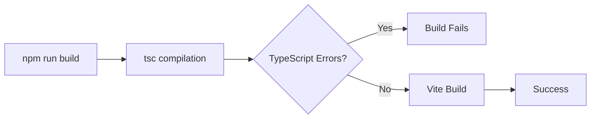
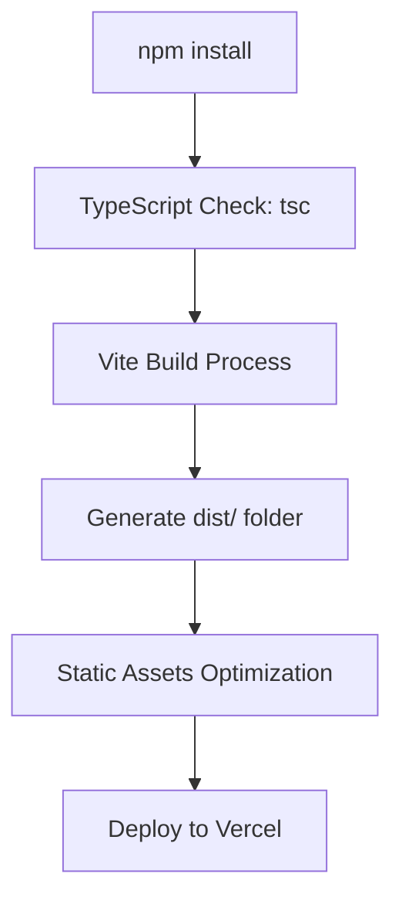

# Vercel Deployment Issue Resolution Design

## Overview

This design document addresses deployment issues encountered when deploying the Territory Educational Platform (React + TypeScript + Vite project) to Vercel. The project uses modern frontend technologies including React 18, TypeScript, Vite as the build tool, and Tailwind CSS for styling.

## Technology Stack Analysis

### Current Project Configuration
- **Frontend Framework**: React 18.2.0
- **Language**: TypeScript 5.0.2
- **Build Tool**: Vite 4.4.5
- **Styling**: Tailwind CSS 3.3.3
- **Routing**: React Router DOM 6.15.0
- **Package Manager**: npm

### Build Configuration
```json
{
  "buildCommand": "npm run build",
  "outputDirectory": "dist", 
  "devCommand": "npm run dev",
  "installCommand": "npm install"
}
```

## Common Vercel Deployment Issues & Solutions

### 1. Build Process Issues

#### TypeScript Compilation Errors
**Problem**: Build fails during TypeScript compilation phase


**Diagnostic Steps**:
- Run `npm run build` locally to identify TypeScript errors
- Check console output for specific error messages
- Verify all imports and type definitions

**Solutions**:
- Fix TypeScript compilation errors in source code
- Ensure all imported modules have correct type definitions
- Add missing type declarations for external libraries
- Update `tsconfig.json` if needed for compatibility

#### Dependency Installation Issues
**Problem**: Dependencies fail to install during Vercel build
**Solutions**:
- Verify `package.json` has all required dependencies
- Clear npm cache: `npm cache clean --force`
- Delete `node_modules` and `package-lock.json`, reinstall locally
- Ensure no missing peer dependencies

### 2. Routing Configuration Issues

#### Client-Side Routing Problems
**Problem**: React Router routes return 404 on direct URL access

**Current Configuration**:
```json
{
  "rewrites": [
    {
      "source": "/(.*)",
      "destination": "/index.html"
    }
  ]
}
```

**Verification**:
- Confirm `vercel.json` includes proper rewrite rules
- Test routing functionality locally with `npm run preview`
- Ensure all routes are properly defined in React Router

### 3. Build Output Verification

#### Build Artifacts Validation
**Build Process Flow**:


**Verification Steps**:
1. Run `npm run build` locally
2. Verify `dist/` directory is created with:
   - `index.html`
   - JavaScript bundles
   - CSS files
   - Asset files
3. Test production build: `npm run preview`

### 4. Environment Configuration Issues

#### Node.js Version Compatibility
**Recommended Settings**:
- Node.js version: 18.x or 20.x
- npm version: Latest stable

**Vercel Configuration**:
Add to `vercel.json`:
```json
{
  "functions": {
    "app/api/**/*.ts": {
      "runtime": "nodejs18.x"
    }
  }
}
```

### 5. Asset and Import Path Issues

#### Case Sensitivity Problems
**Problem**: Import paths work locally but fail on Vercel
**Solutions**:
- Ensure consistent file naming (case-sensitive)
- Verify all import statements use correct casing
- Check component file extensions (.tsx vs .ts)

#### Asset Loading Issues
**Problem**: Static assets not loading properly
**Solutions**:
- Verify asset imports use relative paths
- Ensure assets are in `public/` directory for direct access
- Check Vite asset handling configuration

## Troubleshooting Workflow

### Step 1: Local Build Verification
```powershell
# Clean install dependencies
Remove-Item -Recurse -Force node_modules
Remove-Item package-lock.json
npm install

# Verify build works locally
npm run build

# Test production build
npm run preview
```

### Step 2: Vercel Configuration Check
- Verify `vercel.json` configuration
- Ensure build command is correct: `npm run build`
- Confirm output directory is `dist`
- Check rewrite rules for SPA routing

### Step 3: TypeScript and Linting
```powershell
# Check TypeScript compilation
npx tsc --noEmit

# Run linting
npm run lint

# Fix auto-fixable issues
npm run lint -- --fix
```

### Step 4: Deployment Environment Variables
- Check if any environment variables are required
- Verify API endpoints and external service configurations
- Ensure production URLs are correctly configured

## Recommended Vercel Configuration

### Complete vercel.json
```json
{
  "buildCommand": "npm run build",
  "outputDirectory": "dist",
  "devCommand": "npm run dev", 
  "installCommand": "npm install",
  "rewrites": [
    {
      "source": "/(.*)",
      "destination": "/index.html"
    }
  ],
  "headers": [
    {
      "source": "/(.*)",
      "headers": [
        {
          "key": "X-Content-Type-Options",
          "value": "nosniff"
        },
        {
          "key": "X-Frame-Options", 
          "value": "DENY"
        }
      ]
    }
  ]
}
```

### Build Performance Optimization
- Enable build cache in Vercel dashboard
- Consider splitting large dependencies
- Optimize bundle size with tree shaking

## Common Error Messages & Fixes

### "Command failed with exit code 1"
**Causes**:
- TypeScript compilation errors
- ESLint violations with max-warnings 0
- Missing dependencies

**Fix**: Review build logs for specific error details

### "Module not found" Errors
**Causes**:
- Incorrect import paths
- Missing dependencies
- Case sensitivity issues

**Fix**: Verify all import statements and file paths

### "ENOENT: no such file or directory"
**Causes**:
- Missing build output
- Incorrect output directory configuration

**Fix**: Verify build process creates `dist/` directory

## Testing Deployment Locally

### Simulate Vercel Environment
```powershell
# Install Vercel CLI
npm install -g vercel

# Login to Vercel
vercel login

# Run local Vercel development
vercel dev

# Deploy to preview
vercel --prod
```

## Monitoring and Debugging

### Build Logs Analysis
- Check Vercel dashboard for detailed build logs
- Look for specific error messages during build phase
- Monitor build time and performance

### Runtime Error Monitoring
- Check browser console for JavaScript errors
- Verify network requests are successful
- Test all application routes and functionality

### Performance Verification
- Test loading speeds on different devices
- Verify asset optimization (minification, compression)
- Check lighthouse scores for performance metrics